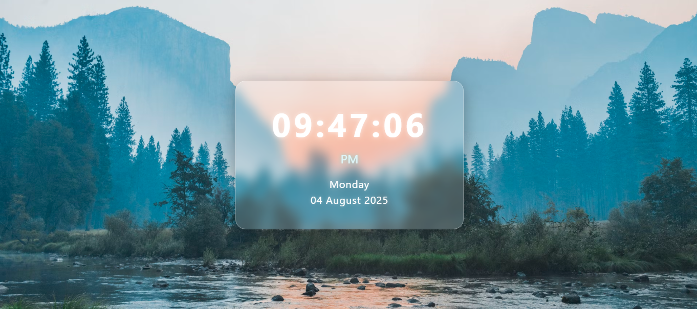

# Digital Clock ⏰

This is a beginner-friendly digital clock built using HTML, CSS, and JavaScript.  
It displays live time in 12-hour format with AM/PM, along with current day and date.

## Features
- Live Time (12-hour format)
- AM/PM indicator
- Dynamic Day and Date
- Nature-themed responsive background
- Vanilla JS – No libraries used

## Demo

## Author
Arghya Basak
